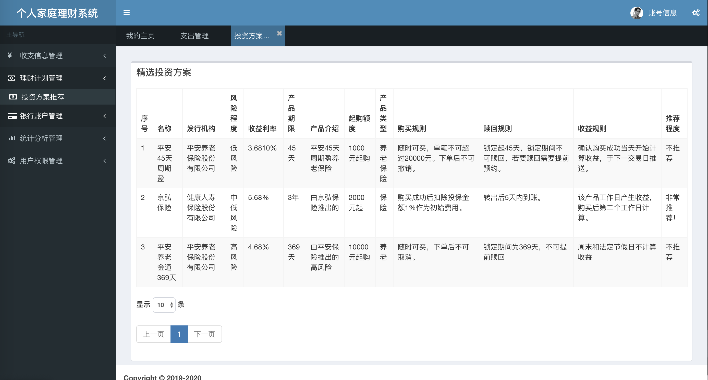

个人家庭理财系统

设计并实现一个基于B/S架构的个人家庭理财系统，主要有管理员和普通用户两个角色。主要功能有：
1. 用户注册登录和权限管理

2. 收支信息管理：记录日常收入及消费情况。
支出：类别（饮食，交通，娱乐，购物，医疗，家居，生活，学习），类型（收入，支出），金额，名称，时间，备注
收入：上同（薪水，奖金，投资，还款，彩票，福利）

3. 统计分析管理：包括日常收支统计及家庭资产统计。

按休闲娱乐,生活日用,交通出行,服饰美容,文体教育,其他分类。
收支统计:可按月,按年查看。表格下面用扇形统计图表示。
支出(收入)类别统计:同上

4.银行账户管理：包括银行存款信息和贷款信息

存款信息：银行名称，存款总额，存款更新时间，最初时间，类别，备注
存款管理:添加的时候希望添加卡号,然后显示卡号后四位,可以按银行名称,卡号尾号查询。
贷款管理:应该是银行名称,贷款总额,贷款年限(期数) ,剩余还款期数,剩余贷款总额,每期还款。

5.理财计划管理：

运用算法，计算得出多种年度投资可选方案，每个方案包含收益及风险，系统初步筛选后，提供最合理的几种方案用于辅助用户决策。
多增加几种理财方案,然后的话,希望能够按照不同的指标推荐不同的方案,比如可以按收入,按负债比例(负债/资产) ,按收入减负债,然后把不推荐的也写出来,标明最推荐和不推荐的。

## 数据库文件需单独联系索要，具体请加QQ：641351484

